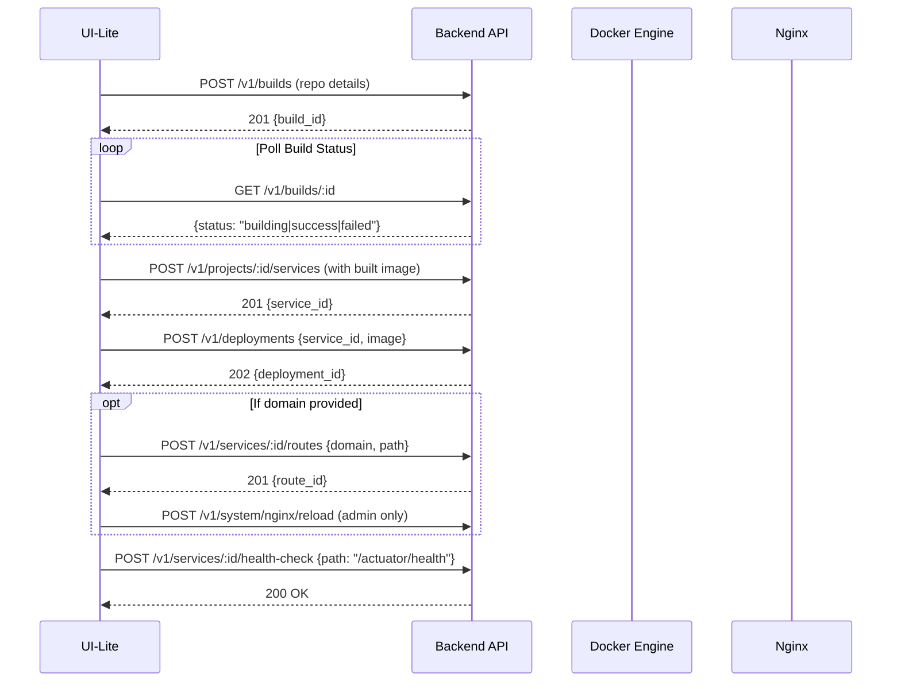

# DEV_PLAN4: Spring Boot Quickstart Wizard

## Overview
Implement "Spring Boot Quickstart Wizard" (Git→Build→Deploy→Route→Health) for UI-Lite. This wizard streamlines the deployment of Spring Boot applications from git repositories to running services with optional routing.

## Constraints
- Keep bundle budgets (JS gz ≤ 35 KB, CSS gz ≤ 20 KB)  
- Reuse current UI patterns/components; no heavy deps
- RBAC: deployer+ to create/deploy; viewer read-only
- Follow docs/AUDIT_CHECKLIST.md; update docs/API.md

## Backend Implementation

### Existing Endpoints (use where available)
- `POST /v1/builds {repo_url, branch, dockerfile?, context?, build_args?}` → 201 {id}
- `GET /v1/builds/:id` → {status, image, logs?}
- `POST /v1/deployments {service_id, image}` → 202 {id}
- `GET /v1/deployments/:id` → {status}
- `POST /v1/projects/:id/services {name,image,env,ports,volumes}` → 201 {service_id}
- `POST /v1/services/:id/routes {domain,path?}` → 201
- Optional: `POST /v1/system/nginx/reload` (admin only)

### New Endpoint (lightweight)
- `POST /v1/services/:id/health-check {path:"/actuator/health"}` → 200
  - Persist default health path for service
  - Alternative: reuse existing config endpoint

## Frontend Implementation

### Routing
- Add route: `/app/quickstart/spring`

### Component Structure
```
pages/Quickstart/
├── SpringBoot.tsx          # Main wizard component
├── components/
│   ├── StepProgress.tsx    # Progress timeline
│   ├── RepoStep.tsx        # Git repository input
│   ├── ServiceStep.tsx     # Service configuration
│   ├── RouteStep.tsx       # Domain routing setup
│   └── ReviewStep.tsx      # Summary and launch
```

### Wizard Steps

#### Step 1: Repository Configuration
- **Input Fields:**
  - `repo_url` (required): Git repository URL with validation
  - `branch` (default: main): Git branch selection
  - `dockerfile` (optional): Custom Dockerfile path
  - `context` (optional): Build context directory
  - `build_args` (optional): Build arguments key-value pairs

- **Validation:**
  - URL format validation for Git repositories
  - Branch existence check (optional API call)
  - Dockerfile path validation

#### Step 2: Service Configuration  
- **Input Fields:**
  - Project selection dropdown
  - Service name (auto-slugified from repo name)
  - Image source confirmation: "Use built image"
  
- **Default Configuration:**
  - Internal port: 8080
  - Environment variables:
    ```
    SPRING_PROFILES_ACTIVE=prod
    SERVER_PORT=8080
    JAVA_TOOL_OPTIONS="-XX:+UseContainerSupport -XX:MaxRAMPercentage=75"
    ```

#### Step 3: Route Configuration
- **Input Fields:**
  - Domain (optional): Custom domain for external access
  - Path (optional): URL path prefix
  
- **Warnings:**
  - Show warning if no domain provided
  - Display example URL format

#### Step 4: Review & Launch
- **Summary Display:**
  - Repository details
  - Service configuration
  - Route setup (if configured)
  - Environment variables
  
- **Launch Button:** Triggers the deployment workflow

### Deployment Workflow



### Progress Timeline UI
- **Visual Steps:**
  1. 🏗️ **Build** - Repository cloning and Docker build
  2. 🚀 **Service** - Service creation with Spring Boot config  
  3. 📦 **Deploy** - Container deployment
  4. 🌐 **Route** - Domain routing setup (if applicable)
  5. ❤️ **Health** - Health check configuration

- **Status Indicators:**
  - ⏳ In Progress (with spinner)
  - ✅ Success (green checkmark)
  - ❌ Failed (red X with error details)
  - ⏸️ Pending (gray circle)

### Error Handling

#### Common Build Failures
- **Dockerfile not found:**
  - Suggestion: "Check if Dockerfile exists in repository root"
  - Option to specify custom Dockerfile path
  
- **Authentication needed:**
  - Clear message about repository access
  - Link to documentation for SSH key setup
  
- **Build timeout:**
  - Option to retry with extended timeout
  - Link to build logs for debugging

#### Error Recovery
- Allow retry from any failed step
- Preserve form data across retries
- Show actionable error messages with next steps

## RBAC Implementation

### Viewer Role
- Show read-only explainer page
- Hide "Deploy" and action buttons
- Display message: "Deployer+ role required to create services"

### Deployer+ Role
- Full wizard access
- All deployment actions enabled
- Route creation available

### Admin Role
- Additional nginx reload capability
- Access to all deployment logs

## Testing Strategy

### Unit Tests (`quickstart-spring.test.tsx`)
```typescript
describe('SpringBoot Quickstart', () => {
  test('happy path: build→service→deploy→route', () => {
    // Test complete wizard flow
  });
  
  test('build error path with retry', () => {
    // Test error handling and recovery
  });
  
  test('viewer RBAC restrictions', () => {
    // Verify viewer cannot access deploy actions
  });
  
  test('form validation', () => {
    // Test Git URL validation, required fields
  });
});
```

### Integration Tests
- End-to-end wizard completion
- API endpoint integration
- Error state handling
- Route creation flow

## Documentation Updates

### docs/API.md
- Document health check endpoint
- Note default Actuator health path behavior
- Wizard deployment sequence documentation

### docs/UI-LITE.md  
- "Spring Boot Quickstart" section
- Step-by-step wizard screenshots
- Configuration examples
- Troubleshooting guide

## Acceptance Criteria

✅ **Repository Integration**
- Git repository with Dockerfile successfully builds
- Build process visible with real-time status updates
- Build logs accessible during and after build

✅ **Service Creation**
- Service created with Spring Boot optimized defaults
- Environment variables properly configured
- Health check path saved to service configuration

✅ **Route Configuration**
- Optional domain routing works correctly
- Admin users can reload nginx configuration
- Proper warnings shown when domain not configured

✅ **Health Monitoring**
- Actuator health endpoint detected and configured
- Health status shows "UP" when available
- Graceful fallback to "unknown" with guidance when Actuator absent

✅ **User Experience**
- Wizard flow is intuitive and guided
- Error states provide actionable feedback
- RBAC properly enforced throughout wizard

✅ **Performance**
- Wizard loads quickly without impacting bundle size
- Real-time updates don't overwhelm the UI
- Proper cleanup of polling when wizard is closed

## Implementation Priority

### Phase 1 (Core Wizard)
1. Basic wizard UI structure
2. Repository input and validation
3. Build integration and polling
4. Service creation with defaults

### Phase 2 (Enhanced Features)  
1. Route configuration
2. Advanced error handling
3. Build log streaming
4. Health check setup

### Phase 3 (Polish)
1. Comprehensive testing
2. Documentation completion
3. Performance optimization
4. RBAC edge cases

## Bundle Size Impact
- Estimated addition: ~8KB (gzipped)
- Reuses existing components and patterns
- No new heavy dependencies
- Well within 35KB JS budget

This implementation provides a streamlined path from git repository to running Spring Boot service while maintaining the existing codebase patterns and performance constraints.

---

## ✅ COMPLETED: UI Modernization & Advanced Features (December 2024)

### Service Detail Page Enhancements

#### Service Control Buttons Redesign
- **Smart Button Logic**: Context-aware button visibility based on service status
  - Start button only appears for stopped/error/paused services
  - Stop button only for running/starting services  
  - Restart button only for running services
- **Right-Aligned Layout**: Moved control buttons to the right corner for better UX
- **Removed Redundancy**: Eliminated health button (status already visible on page)
- **Component Extraction**: Created reusable `ServiceControlButtons` component

#### Icon System Consolidation
- **Lucide Icons Migration**: Replaced all inline SVG strings with lucide-preact icons
- **Consistent Visual Language**: Unified tab icons across the interface
  - Overview: LayoutDashboard
  - Logs: FileText  
  - Config: Settings
  - Environment: Tag
  - Ports: Network
  - Volumes: HardDrive
  - Networking: Wifi
  - Advanced: Shield
- **Simplified Rendering**: Removed hybrid SVG/component system for cleaner code

#### Advanced Settings Tab
- **Container Intelligence**: Comprehensive container details display
  - Container ID, image details, platform info
  - Creation dates, project relationships, DNS configuration
- **Runtime Configuration View**: 
  - Resource limits and health check settings
  - Restart policies and environment summaries
  - Volume mount and networking details
- **System Integration Panel**: Docker network info, platform details, label management

#### Danger Zone Implementation
- **Secure Service Deletion**: Multi-step confirmation with service name verification
- **Safety Measures**: 
  - Exact name matching requirement
  - Loading states and error handling
  - Comprehensive deletion warnings
- **Future-Ready Actions**: Placeholder for reset/destructive operations
- **User Protection**: Clear impact explanations and recovery information

### Code Quality Improvements
- **Component Modularity**: Better separation of concerns with focused components
- **TypeScript Cleanup**: Removed unused imports and improved type safety
- **Performance Optimization**: Reduced bundle size by eliminating redundant code
- **RBAC Integration**: Proper role-based access control throughout advanced features

### Bundle Impact
- **Net Size Reduction**: Despite new features, achieved smaller bundle through code cleanup
- **Optimized Imports**: Tree-shaking friendly icon imports
- **Component Reuse**: Leveraged existing UI patterns and components